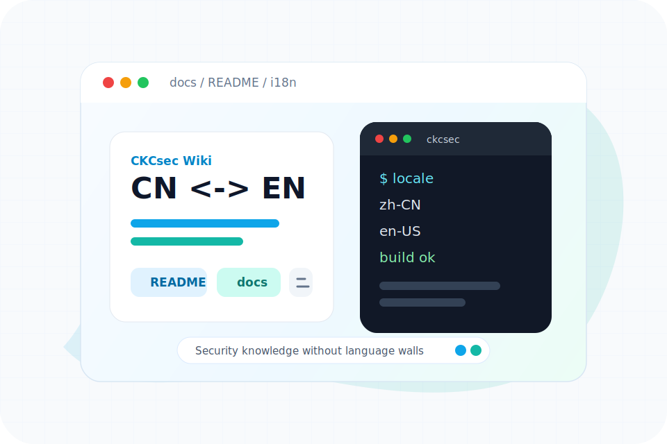

# CKCsec Wiki

[中文](#中文) | [English](#english)

## 中文

CKCsec安全研究院是一个面向网络安全从业者的知识文库，内容覆盖 Web 安全、区块链安全、CTF、红蓝对抗、应急响应等方向，目标是把可检索、可学习、可共享的安全实践沉淀下来。

当前项目基于 VitePress 构建，中文站点为默认入口，同时已经加入英文入口，为后续国际化内容建设做好准备。

### 使用须知

由于传播、利用此文库所提供的信息而造成的任何直接或者间接的后果及损失，均由使用者本人负责，文章作者不承担相关责任。

CKCsec安全研究院拥有对此文库的修改和解释权。如需转载或传播本文库内容，请保证内容完整，包括版权声明等全部信息。未经作者允许，不得任意修改、增减文章内容，也不得以任何方式将其用于商业目的。文章中如无特殊声明，默认作者为 ckcsec。

### 关于开源

我相信开源、免费、共享是长期有价值的方向，所以文库文章和站点源码都公开可查阅、下载和改进。希望它能帮助每一位正在为网络安全努力的人。

欢迎点击 Star，给项目一个小星星。

### 支持项目

写博客和维护文库长期处在用爱发电的状态。如果你觉得内容对你有帮助，也可以考虑支持本项目，就当是给忙碌更新的作者买一杯咖啡。

  

### 关注公众号

关注公众号，快速获取安全相关资讯与更新动态。

  

### 鸣谢

感谢以下项目作为本文库的核心技术支撑：

- [VitePress](https://vitepress.dev/)
- [vuejs/vitepress](https://github.com/vuejs/vitepress)
- [Vercel](https://vercel.com/)

## English

CKCsec Wiki is a security research knowledge base for practitioners. It covers Web security, blockchain security, CTF, red team topics, incident response, and related hands-on notes. The goal is to preserve practical security knowledge in a form that is searchable, learnable, and shareable.

The project is built with VitePress. Chinese remains the default content source, and an English entry point is now available so the project can evolve toward broader international access.

### Usage Notice

The information in this knowledge base is provided for learning, research, and authorized security work. Any direct or indirect consequences or losses caused by spreading, modifying, or using the information are the responsibility of the user.

CKCsec reserves the right to modify and interpret this knowledge base. When redistributing or referencing content, please keep the original content complete, including copyright notices and attribution. Do not modify, remove, or use the content for commercial purposes without permission. Unless otherwise stated, articles are authored by ckcsec.

### Open Source

Open, free, and shared knowledge has long-term value. The articles and site source are publicly available so readers can learn from them and help improve them.

If the project helps you, a GitHub Star is appreciated.

### Support

Maintaining a knowledge base takes time. If the content is useful to you, you can support the project as a small encouragement for continued writing and updates.

### Follow Updates

The Chinese public account shares security updates and project news. International readers can also watch the GitHub repository for changes.

### Acknowledgements

This project is powered by:

- [VitePress](https://vitepress.dev/)
- [vuejs/vitepress](https://github.com/vuejs/vitepress)
- [Vercel](https://vercel.com/)
